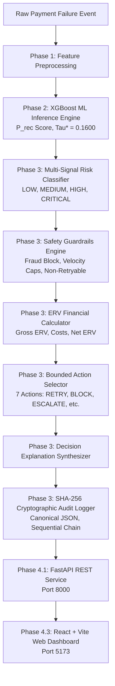

# REVORA — Autonomous Payment Failure Recovery & Decision Engine

[](tests/)
[](src/api/)
[](frontend/)
[](frontend/)
[](https://github.com/skyhitec/REVORA)

REVORA is an autonomous, production-grade payment failure recovery and policy decision system. It combines calibrated machine learning predictions, multi-signal risk classification, deterministic safety guardrails, Expected Recovery Value (ERV) financial math, and cryptographic SHA-256 tamper-evident audit logging.

---

## 📌 Executive Overview

Payment failure recovery in digital commerce often relies on blind retries or manual operations. Uncoordinated retries trigger card network fines, increase customer friction, and waste operational costs on unrecoverable failures.

REVORA solves this by providing an **automated decision engine** that evaluates failed payment transactions in real time. Instead of retriving blindly, REVORA predicts recovery probability ($P_{\text{rec}}$), computes Expected Recovery Value (ERV) net of costs, enforces strict deterministic safety guardrails, and produces human-readable decision explanations backed by an immutable SHA-256 audit log.

---

## 🎯 Problem Statement

Traditional payment failure recovery suffers from three critical flaws:
1. **Blind Retries**: Attempting retries on non-retryable failures (e.g., `EXPIRED_CARD`, `INVALID_CREDENTIALS`) wastes transaction fees and degrades customer trust.
2. **Fraud & Velocity Risks**: Retrying flagged transactions without safety checks risks chargebacks and security violations.
3. **Lack of Auditability**: Operations teams cannot verify whether past recovery actions adhered to compliance and risk policies.

---

## 💡 Solution

REVORA unifies ML probability scoring with deterministic decision guardrails and cryptographic verification:
- **Calibrated ML Scoring**: XGBoost model predicts exact recovery probability ($P_{\text{rec}}$) with an optimal locked threshold ($\tau^* = 0.1600$).
- **Multi-Signal Risk Engine**: Classifies risk (`LOW`, `MEDIUM`, `HIGH`, `CRITICAL`) using failure codes, customer payment velocity, and merchant risk scores.
- **Deterministic Safety Guardrails**: Hard policy rules override ML scores to enforce zero fraud retries, respect customer velocity caps, and suppress invalid attempts.
- **Net ERV Optimization**: Financial math calculates Gross ERV vs Net Yield after deducting action costs and friction penalties.
- **Cryptographic Auditability**: Every decision is linked sequentially using SHA-256 hashing in an append-only JSONL audit trail ($O(N)$ tamper detection).

---

## ✨ Key Features

- **XGBoost Recovery Prediction**: Calibrated probability model predicting recovery likelihood ($P_{\text{rec}}$) with locked optimal threshold $\tau^* = 0.1600$.
- **Multi-Signal Risk Classification**: 4 risk tiers (`LOW`, `MEDIUM`, `HIGH`, `CRITICAL`) driving bounded action bounds.
- **Deterministic Safety Guardrails**: Hard policy guardrails (`FRAUD_RISK_BLOCK`, non-retryable codes, velocity limits).
- **Financial ERV Calculation**: Net Expected Recovery Value math ($P_{\text{rec}} \times \text{Amount} - \text{Intervention Cost} - \text{Friction Penalty}$).
- **Bounded Intervention Actions**: 7 decision actions (`RETRY`, `DELAY_AND_RETRY`, `RETRY_WITH_CAUTION`, `CUSTOMER_ACTION_REQUIRED`, `ESCALATE`, `BLOCK`, `NO_ACTION`).
- **Human-Readable Explanations**: Synthesized decision rationale text per transaction.
- **SHA-256 Cryptographic Audit Chain**: Sequential append-only JSONL ledger starting from a deterministic Genesis hash ($H_0$).
- **Real-Time Transaction Simulator**: Configurable synthetic failure event generator with pacing controls (0.5s–2.0s).
- **Production FastAPI REST API**: Endpoints for prediction, decision evaluation, simulation, metrics, and audit verification.
- **React 18 + Vite Web Dashboard**: Dark fintech single-page application with 5 interactive views.
- **Cryptographic Audit Verifier**: Interactive UI component for $O(N)$ linear hash chain verification.
- **Buildathon Demo Studio**: 5 pre-configured one-click scenario cards for live demonstrations.

---

## 🏗️ System Architecture



### Development Phases Overview:
- **Phase 1: Data Engine**: Synthetic failure data generator, schema validation, target leakage checker, and stratified splitter.
- **Phase 2: Recovery Prediction Engine**: Feature engineering pipeline, XGBoost training with probability calibration, and inference engine.
- **Phase 3: Policy & Decision Engine**: Risk classification, safety guardrails, ERV calculator, intervention selector, decision explainer, and SHA-256 cryptographic audit trail.
- **Phase 4.1: Production REST API**: FastAPI backend exposing predict, decide, simulate, metrics, audit, and demo endpoints.
- **Phase 4.2: Real-Time Simulator**: Payment stream simulator with rate control, batching, and seed replay.
- **Phase 4.3: Web Dashboard**: Single-page React 18 + Vite frontend with 5 interactive views.

---

## 🔄 End-to-End Decision Flow

1. **Transaction Input**: A failed payment payload (amount, failure code, payment method, customer history) enters the engine.
2. **Feature Preprocessing**: `FeaturePipeline` transforms categorical variables and scales numerical features.
3. **ML Inference**: `RecoveryInferenceEngine` computes calibrated recovery probability $P_{\text{rec}}$ using XGBoost.
4. **Risk Classification**: `RiskClassifier` assigns a risk level (`LOW`, `MEDIUM`, `HIGH`, `CRITICAL`).
5. **Safety Guardrail Evaluation**: `SafetyGuardrails` tests hard rules (e.g., `FRAUD_RISK_BLOCK` forces `BLOCK`).
6. **Action Selection**: `InterventionSelector` maps $P_{\text{rec}}$, risk level, and guardrail outputs to one of 7 bounded actions.
7. **ERV Math**: `ERVCalculator` computes Gross ERV, subtracts intervention cost and friction penalty, yielding Net Expected Recovery Value.
8. **Explanation Rationale**: `DecisionExplainer` synthesizes natural language rationale explaining the output.
9. **Cryptographic Logging**: `AuditLogger` & `HashChainEngine` construct canonical JSON, compute SHA-256 composite hash ($H_i$), and write to `data/audit/audit_trail.jsonl`.
10. **Response Delivery**: FastAPI returns JSON response to REST clients or the React Web Dashboard.

---

## 💻 Tech Stack

- **Core & Backend**: Python 3.13, FastAPI 0.115, Pydantic V2, Uvicorn
- **Machine Learning**: XGBoost 2.1, Scikit-Learn 1.6, NumPy, Pandas, SHAP
- **Frontend**: React 18, Vite 5, Tailwind CSS 3, Lucide React
- **Audit & Cryptography**: Python Standard Library `hashlib` (SHA-256), JSON
- **Testing & Tooling**: Pytest 9.1, Pytest-Asyncio, Faker

---

## 📁 Project Structure

```text
REVORA/
├── config/                         # Configuration files
│   ├── dataset_config.yaml         # Dataset columns & failure taxonomy definition
│   ├── policy_config.yaml          # Policy thresholds, action costs, & friction penalties
│   └── api_config.yaml             # API service settings
├── data/                           # Data storage directory
│   ├── raw/                        # Generated raw transaction data
│   ├── processed/                  # Processed train/validation/test datasets
│   └── audit/                      # Cryptographic JSONL audit trail logs
├── docs/                           # Documentation
│   ├── architecture.md             # Detailed system architecture specification
│   └── phase4_3_dashboard.md       # Interactive Web Dashboard guide
├── frontend/                       # React 18 + Vite SPA Frontend
│   ├── src/
│   │   ├── components/             # Reusable UI components (KPICard, Navbar, Modal, etc.)
│   │   ├── pages/                  # 5 Main Page views (Overview, Simulator, Inspector, etc.)
│   │   ├── services/               # API client service layer (api.js)
│   │   ├── App.jsx                 # Main application router
│   │   └── main.jsx                # React DOM entry point
│   ├── package.json                # Frontend dependencies
│   ├── tailwind.config.js          # Fintech dark mode design system configuration
│   └── vite.config.js              # Vite dev server with API proxy settings
├── models/                         # Serialized ML model artifacts
│   ├── xgboost_recovery_model.pkl  # Calibrated XGBoost model
│   ├── feature_pipeline.pkl        # Fitted Sklearn feature pipeline
│   └── metrics.json                # Phase 2 evaluation metrics
├── scripts/                        # Executable script utilities
│   ├── start_demo.py               # Unified Python launcher for FastAPI + Vite Dashboard
│   ├── start_revora.bat            # Windows batch launcher script
│   ├── stop_revora.bat             # Windows batch shutdown script
│   └── run_simulator.py            # CLI launcher for real-time transaction simulator
├── src/                            # Core REVORA source package
│   ├── api/                        # FastAPI application & route definitions
│   │   ├── main.py                 # App factory & /health endpoint
│   │   ├── schemas.py              # Pydantic V2 request & response schemas
│   │   ├── dependencies.py         # Shared dependency injectors
│   │   └── routes/                 # Endpoint routers (predict, decide, simulate, audit, metrics, demo)
│   ├── audit/                      # Cryptographic SHA-256 audit logger & verifier
│   ├── data/                       # Data generator, validator, & leakage checker
│   ├── decision/                   # Decision engine, ERV calculator, risk classifier, selector, explainer
│   ├── ml/                         # Feature pipeline, model trainer, & inference engine
│   ├── policy/                     # Safety guardrails & failure classifier
│   ├── schemas/                    # Internal data classes & dataclasses
│   └── simulator/                  # Real-time event generator & stream processor
└── tests/                          # Automated Pytest test suite (58 tests)
    ├── api/                        # Integration tests for FastAPI endpoints
    └── test_*.py                   # Unit & component integration tests
```

---

## 📡 API Reference

### 1. `GET /health`
- **Purpose**: Returns service status, version, active phase, and UTC timestamp.
- **Response Example**:
```json
{
  "status": "ok",
  "version": "1.0.0",
  "phase": "Phase 4.1 — Production FastAPI API Layer",
  "timestamp": "2026-08-24T21:40:00.000000+00:00"
}
```

### 2. `POST /api/v1/predict`
- **Purpose**: Calculates ML recovery probability ($P_{\text{rec}}$) for a failed transaction.
- **Request Payload**:
```json
{
  "transaction_id": "tx_req_101",
  "amount": 2500.0,
  "payment_method": "UPI",
  "payment_gateway": "RAZORPAY",
  "failure_code": "TEMPORARY_GATEWAY_FAILURE",
  "customer_payment_success_rate": 0.90,
  "customer_previous_transactions": 15,
  "customer_previous_failures": 1,
  "days_since_last_successful_payment": 1.0,
  "ip_risk_score": 5.0,
  "merchant_risk_score": 5.0,
  "payment_status": "FAILED",
  "is_retryable": true
}
```
- **Response Example**:
```json
{
  "transaction_id": "tx_req_101",
  "predicted_recovery_probability": 0.8524,
  "optimal_threshold": 0.1600,
  "should_intervene": true
}
```

### 3. `POST /api/v1/decide`
- **Purpose**: Evaluates a transaction through Phase 3 risk, guardrails, action selection, and ERV math; records SHA-256 audit log.
- **Request Payload**:
```json
{
  "transaction_id": "tx_dec_201",
  "amount": 5000.0,
  "failure_code": "TEMPORARY_GATEWAY_FAILURE",
  "payment_method": "UPI",
  "predicted_recovery_probability": 0.85
}
```
- **Response Example**:
```json
{
  "decision_id": "dec_a1b2c3d4e5f6",
  "transaction_id": "tx_dec_201",
  "customer_id": "cust_unknown",
  "merchant_id": "merch_unknown",
  "timestamp": "2026-08-24T21:40:00Z",
  "amount": 5000.0,
  "failure_code": "TEMPORARY_GATEWAY_FAILURE",
  "retryability": true,
  "recovery_probability": 0.85,
  "expected_recovery_value": 4250.0,
  "intervention_cost": 10.0,
  "net_expected_recovery_value": 4238.0,
  "risk_level": "LOW",
  "decision": "RETRY",
  "reason": "Action RETRY selected for LOW risk failure TEMPORARY_GATEWAY_FAILURE...",
  "policy_checks": [
    {
      "rule_id": "RULE_FRAUD_BLOCK",
      "rule_name": "Fraud Risk Block Check",
      "passed": true,
      "reason": "Transaction clear of fraud risk flag",
      "forced_decision": null
    }
  ],
  "policy_version": "1.0.0"
}
```

### 4. `POST /api/v1/simulate`
- **Purpose**: Generates and processes a single synthetic failure event through the complete prediction and decision pipeline.
- **Request Payload**:
```json
{
  "amount": 1800.0,
  "failure_code": "TEMPORARY_GATEWAY_FAILURE",
  "payment_method": "UPI",
  "recovery_probability": 0.75
}
```

### 5. `POST /api/v1/audit/verify`
- **Purpose**: Verifies SHA-256 hash-chain cryptographic integrity of an audit JSONL file.
- **Query Parameter**: `filepath=data/audit/val_audit.jsonl`
- **Response Example**:
```json
{
  "is_valid": true,
  "log_filepath": "data/audit/val_audit.jsonl",
  "total_records": 1500,
  "errors": []
}
```

### 6. `GET /api/v1/metrics`
- **Purpose**: Returns aggregate system metrics, revenue at risk, expected recoverable revenue, and net yield.

### 7. `GET /api/v1/demo/scenarios` & `POST /api/v1/demo/run/{scenario_id}`
- **Purpose**: Lists pre-configured buildathon presentation scenarios and executes named scenarios.

---

## 🚀 Quickstart Guide

### Prerequisites
- Python 3.10+ (Tested on Python 3.13.14)
- Node.js 18+ & npm

### 1. Environment Setup (Windows PowerShell)

```powershell
# Clone repository
git clone https://github.com/skyhitec/REVORA.git
cd REVORA

# Create and activate virtual environment
python -m venv .venv
.venv\Scripts\Activate.ps1

# Install backend dependencies
pip install -r requirements.txt

# Install frontend dependencies
cd frontend
npm install
cd ..
```

### 2. One-Click System Launchers

#### Option A: Windows Batch Launcher
```cmd
scripts\start_revora.bat
```
*(To stop servers safely: `scripts\stop_revora.bat`)*

#### Option B: Cross-Platform Python Launcher
```powershell
python scripts/start_demo.py
```

- **Web Dashboard**: `http://localhost:5173`
- **FastAPI OpenAPI Swagger**: `http://127.0.0.1:8000/docs`

---

## 🧪 Running Tests

Run the complete Pytest suite (58 unit & integration tests):

```powershell
pytest -q
```

**Verified Test Result**:
```text
58 passed in 22.06s
```

---

## 💻 Web Dashboard Views

1. **Executive Recovery Overview**: High-level KPI summary cards and 4-stage visual revenue recovery funnel.
2. **Real-Time Stream Simulator**: Streaming failure feed table, pacing controls (0.5s–2.0s), and custom event injector form.
3. **Transaction Deep-Dive Inspector**: Interactive modal rendering raw features, $P_{\text{rec}}$ score, risk level, Net ERV financial math breakdown, deterministic guardrails checklist, and explanation text.
4. **Cryptographic Audit Verifier**: Interactive SHA-256 hash-chain verification tool displaying total records, Genesis hash, and tamper-proof badge.
5. **Buildathon Demo Studio**: 5 pre-configured one-click scenario cards for live demonstrations.


---

## 🔒 Cryptographic Audit System

REVORA guarantees append-only audit trail immutability using SHA-256 cryptographic hash-chaining:

- **Genesis Hash ($H_0$)**: Fixed initial seed digest:
  $$H_0 = \text{SHA256}(\text{"REVORA\_PHASE3\_GENESIS"})$$
- **Canonical JSON Serialization**: Data fields (excluding `current_hash`) are deterministically sorted by key and serialized with compact separators.
- **Sequential Chain Link ($H_i$)**:
  $$H_i = \text{SHA256}(H_{i-1} \parallel \text{CanonicalJSON}(R_i))$$
- **Tamper Detection**: `AuditVerifier.verify_audit_file()` reads records sequentially, re-evaluates all composite hashes, and flags any altered characters, missing lines, or reordered records in $O(N)$ linear time.


---

## 🤖 ML Pipeline

- **Feature Engineering**: Categorical encoding and standard scaling via `FeaturePipeline` (`models/feature_pipeline.pkl`).
- **Model Architecture**: XGBoost classifier trained with probability calibration (`models/xgboost_recovery_model.pkl`).
- **Predicted Probability ($P_{\text{rec}}$)**: Calibrated score representing likelihood of successful payment recovery ($P(\text{recovered}=1)$).
- **Locked Threshold ($\tau^* = 0.1600$)**: Frozen optimal decision boundary optimized during Phase 2 training.
- **Data Partitioning**: 70% Train / 15% Validation / 15% Test stratified split.

---

## ⚖️ Decision & Policy Engine

- **Risk Levels**: Multi-signal scoring assigns `LOW`, `MEDIUM`, `HIGH`, or `CRITICAL` risk.
- **Safety Guardrails**: Hard policy checks (`FRAUD_RISK_BLOCK`, non-retryable codes, velocity limits).
- **Intervention Actions**: 7 bounded actions (`RETRY`, `DELAY_AND_RETRY`, `RETRY_WITH_CAUTION`, `CUSTOMER_ACTION_REQUIRED`, `ESCALATE`, `BLOCK`, `NO_ACTION`).
- **ERV Financial Math**:
  $$\text{Gross ERV} = \text{Amount} \times P_{\text{rec}}$$
  $$\text{Net ERV} = \text{Gross ERV} - \text{Intervention Cost} - \text{Friction Penalty}$$
- **Explanation Generation**: Automated natural language rationale text explaining the decision and policy checks.


---

## 🎬 Buildathon Demo Scenarios

1. **Transient Gateway Retry**: `TEMPORARY_GATEWAY_FAILURE`, $P_{\text{rec}} = 85\%$ $\rightarrow$ `RETRY` (Emerald).
2. **VIP High-Value Escalate**: High-value corporate auth failure, amount = ₹45,000 $\rightarrow$ `ESCALATE` (Violet).
3. **Fraud Risk Block**: High probability ($92\%$) overridden by mandatory `FRAUD_RISK_BLOCK` guardrail $\rightarrow$ `BLOCK` (Rose).
4. **Expired Card Customer Nudge**: Non-retryable `EXPIRED_CARD` failure $\rightarrow$ `CUSTOMER_ACTION_REQUIRED` (Gold).
5. **Negative ERV Skip**: Low probability ($12\%$) where retry cost exceeds expected recovery $\rightarrow$ `NO_ACTION` (Blue).


---

## ✅ Quality & Verification

- **Automated Test Suite**: 58 / 58 tests passing (`pytest -q`).
- **Frontend Production Build**: Clean build via Vite (`npm run build`).
- **Git Checkpoint Tags**: `phase-3-complete`, `phase-4.2-complete`, `phase-4-complete` (commit `921ac53`).

---

## 📜 Phase Development History

- **Phase 1: Data Engine**: Synthetic dataset generation, schema validation, leakage prevention, and stratified splitting. *(Tagged: `phase-3-complete`)*
- **Phase 2: Recovery Prediction Engine**: XGBoost probability model, probability calibration, and feature pipeline. *(Tagged: `phase-3-complete`)*
- **Phase 3: Policy & Decision Engine**: Multi-signal risk engine, safety guardrails, ERV calculator, intervention selector, explainer, and SHA-256 audit logger. *(Tagged: `phase-3-complete`, commit `fbf4906`)*
- **Phase 4.1: Production REST API**: FastAPI backend service exposing predict, decide, simulate, audit, metrics, and demo endpoints. *(Tagged: `phase-4-complete`, commit `921ac53`)*
- **Phase 4.2: Real-Time Simulator**: Payment failure stream simulator with rate controls and seed replay. *(Tagged: `phase-4.2-complete`, commit `8cef435`)*
- **Phase 4.3: Web Dashboard**: React 18 + Vite single-page application with 5 interactive views. *(Tagged: `phase-4-complete`, commit `921ac53`)*

---

## 🔮 Future Roadmap (Ideas for Future Development)

- [ ] **Multi-Gateway Adaptive Routing**: Dynamic routing of retries across multiple gateway providers based on real-time gateway health.
- [ ] **Reinforcement Learning Policy Tuning**: Contextual bandit algorithms for dynamic intervention cost balancing.
- [ ] **WebHook Event Subscriptions**: Outbound WebHooks for notifying merchant systems of escalation events.

---

## 📄 License

License: Not yet specified.
