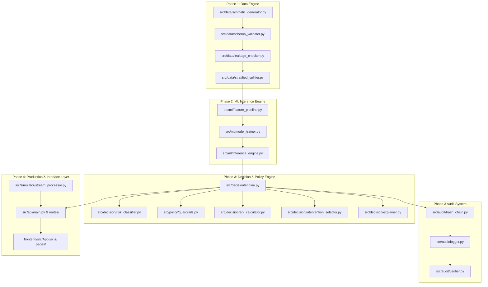
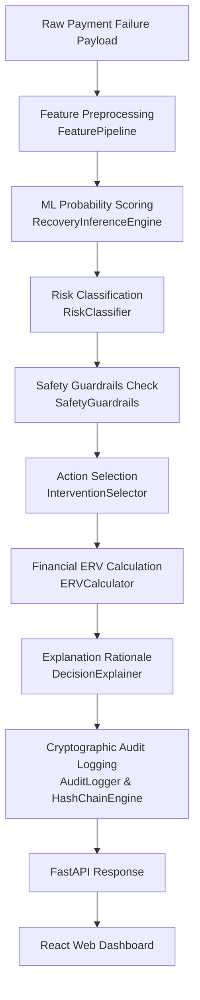

# REVORA System Architecture Specification

This document provides a technical specification of the system architecture, component responsibilities, data flow pipelines, API services, frontend SPA modules, and cryptographic audit mechanism in REVORA.

---

## 1. Architecture Overview

REVORA is architected as a **4-Tier Modular System** designed for high-throughput, autonomous payment recovery decisioning:

```text
+-----------------------------------------------------------------------------------+
|                                 REVORA ARCHITECTURE                               |
+-----------------------------------------------------------------------------------+
                                          |
+--------------------------+  +--------------------------+  +--------------------------+
| Phase 1: Data Engine     |  | Phase 2: ML Engine       |  | Phase 3: Decision Engine |
| - Data Generator         |  | - Feature Pipeline       |  | - Risk Classifier        |
| - Schema Validator       |  | - XGBoost Model          |  | - Safety Guardrails      |
| - Leakage Checker        |  | - Calibration            |  | - ERV Calculator         |
| - Stratified Splitter    |  | - Tau* = 0.1600 Threshold|  | - SHA-256 Audit Logger   |
+--------------------------+  +--------------------------+  +--------------------------+
                                          |
+-----------------------------------------v-----------------------------------------+
| Phase 4: Production & Interface Layer                                             |
| +--------------------------------+-------------------------------+----------------+
| | FastAPI REST API (Port 8000)   | Real-Time Simulator           | React Vite SPA |
| +--------------------------------+-------------------------------+----------------+
+-----------------------------------------------------------------------------------+
```

1. **Phase 1 (Data Foundation)**: Generates synthetic payment failure data across 10 failure categories, validates schema bounds, ensures zero target leakage, and splits data reproducibly.
2. **Phase 2 (Recovery Prediction Engine)**: Transforms pre-recovery features and applies an XGBoost model with probability calibration to predict recovery probability ($P_{\text{rec}}$) against a locked threshold ($\tau^* = 0.1600$).
3. **Phase 3 (Decision & Policy Engine)**: Evaluates multi-signal risk, tests deterministic safety guardrails, calculates Net Expected Recovery Value (ERV), selects bounded actions, synthesizes explanations, and logs SHA-256 audit records.
4. **Phase 4 (Production & Interface Layer)**: Exposes REST API endpoints via FastAPI, streams real-time synthetic payment events via the transaction simulator, and presents an interactive web dashboard built with React 18 and Vite.

---

## 2. System Architecture Diagram



---

## 3. Component Responsibilities

| Component | File Path | Responsibility |
| :--- | :--- | :--- |
| **Synthetic Generator** | `src/data/synthetic_generator.py` | Generates realistic synthetic payment failure transactions covering 10 failure codes with zero target leakage. |
| **Schema Validator** | `src/data/schema_validator.py` | Enforces structural data validation rules, data types, and numerical boundaries. |
| **Leakage Checker** | `src/data/leakage_checker.py` | Strips post-recovery columns (`recovery_status`, `recovered_amount`) before feature processing. |
| **Stratified Splitter** | `src/data/stratified_splitter.py` | Partitions dataset into 70% Train, 15% Validation, 15% Test datasets with preserved class proportions. |
| **Feature Pipeline** | `src/ml/feature_pipeline.py` | Preprocesses numerical and categorical features (`models/feature_pipeline.pkl`). |
| **Model Trainer** | `src/ml/model_trainer.py` | Trains XGBoost classifier with isotonic probability calibration (`models/xgboost_recovery_model.pkl`). |
| **Inference Engine** | `src/ml/inference_engine.py` | Computes recovery probability $P_{\text{rec}}$ using locked optimal threshold $\tau^* = 0.1600$. |
| **Risk Classifier** | `src/decision/risk_classifier.py` | Computes multi-signal risk score and assigns risk level (`LOW`, `MEDIUM`, `HIGH`, `CRITICAL`). |
| **Safety Guardrails** | `src/policy/guardrails.py` | Enforces hard policy constraints (`FRAUD_RISK_BLOCK`, non-retryable failure codes, velocity caps). |
| **ERV Calculator** | `src/decision/erv_calculator.py` | Computes Gross ERV, intervention cost, friction penalty, and Net Expected Recovery Value. |
| **Intervention Selector**| `src/decision/intervention_selector.py` | Selects bounded action (`RETRY`, `DELAY_AND_RETRY`, `RETRY_WITH_CAUTION`, `CUSTOMER_ACTION_REQUIRED`, `ESCALATE`, `BLOCK`, `NO_ACTION`). |
| **Decision Explainer** | `src/decision/explainer.py` | Synthesizes natural language rationale text explaining policy outputs. |
| **Policy Engine** | `src/decision/engine.py` | Orchestrates risk scoring, guardrails, ERV math, action selection, and explanation synthesis. |
| **Hash Chain Engine** | `src/audit/hash_chain.py` | Computes canonical JSON serialization and SHA-256 sequential composite hash link. |
| **Audit Logger** | `src/audit/logger.py` | Appends cryptographically chained audit records to `data/audit/audit_trail.jsonl`. |
| **Audit Verifier** | `src/audit/verifier.py` | Validates hash chain integrity from Genesis hash $H_0$ in $O(N)$ linear time. |
| **FastAPI REST API** | `src/api/main.py` | Service application factory exposing `/health`, `/predict`, `/decide`, `/simulate`, `/audit/verify`, `/metrics`, `/demo`. |
| **Stream Simulator** | `src/simulator/stream_processor.py` | Generates real-time synthetic transaction streams for live dashboard monitoring. |
| **React Dashboard** | `frontend/src/App.jsx` | Single-page React 18 + Vite dashboard with 5 interactive views. |

---

## 4. End-to-End Data Flow



---

## 5. API Architecture

The Phase 4.1 REST API is built on FastAPI:

- **Client Requests**: The React dashboard or external API clients issue HTTP POST/GET requests.
- **Dependency Injection**: `src/api/dependencies.py` provides thread-safe singleton instances of `RecoveryInferenceEngine`, `RecoveryPolicyEngine`, and `AuditLogger`.
- **Validation**: Request body validation handled automatically by Pydantic V2 schemas (`src/api/schemas.py`).
- **Response Construction**: Routes format internal `DecisionObject` models into standard JSON response objects.

```text
React SPA Frontend / REST Client
       │
       ▼
 FastAPI Router (src/api/main.py)
       │
       ├── Dependencies Injector (src/api/dependencies.py)
       │       ├── RecoveryInferenceEngine
       │       ├── RecoveryPolicyEngine
       │       └── AuditLogger
       │
       ▼
 Core Engine Execution (src/decision/engine.py)
       │
       ▼
 Cryptographic Audit Writer (data/audit/audit_trail.jsonl)
       │
       ▼
 JSON Response Delivery
```

---

## 6. Frontend Architecture

The frontend application (`frontend/`) is a React 18 Single-Page Application (SPA) bundled with Vite 5:

- **Root Component**: `frontend/src/App.jsx` manages active tab navigation state (`overview`, `simulator`, `inspector`, `audit`, `demo`) and global inspector modal transaction state.
- **Service Layer**: `frontend/src/services/api.js` centralizes async fetch requests targeting FastAPI endpoints.
- **Page Modules**:
  - `OverviewPage.jsx`: Renders top KPI metrics and 4-stage visual revenue recovery funnel.
  - `SimulatorPage.jsx`: Renders live payment stream table, pacing controls, and custom event injector.
  - `DeepDivePage.jsx`: Renders interactive policy engine inspector page.
  - `AuditPage.jsx`: Renders SHA-256 hash-chain specification and verifier widget.
  - `DemoStudioPage.jsx`: Renders 5 one-click buildathon scenario cards.
- **UI Components**:
  - `Navbar.jsx`: Top header with API health pill.
  - `KPICard.jsx`: Glassmorphic summary cards.
  - `DecisionBadge.jsx`: Action & risk level badges.
  - `InspectorModal.jsx`: Deep-dive modal rendering ERV breakdown, guardrails, and explanation.
  - `AuditVerifierWidget.jsx`: SHA-256 hash chain verification widget.
  - `BuildathonDemoCards.jsx`: Presentation demo scenario cards.

---

## 7. Cryptographic Audit Architecture

REVORA implements an append-only, tamper-evident decision log backed by sequential SHA-256 hash chaining:

### Mathematical Specification

1. **Genesis Hash ($H_0$)**:
   $$H_0 = \text{SHA256}(\text{"REVORA\_PHASE3\_GENESIS"})$$

2. **Canonical JSON Serialization**:
   Record dict $R_i$ (excluding `current_hash`) is converted to canonical JSON string $C_i$:
   $$C_i = \text{CanonicalJSON}(R_i)$$
   - Keys sorted alphabetically (`sort_keys=True`).
   - Compact separators (`','`, `':'`).
   - Unicode escaped (`ensure_ascii=True`).

3. **Sequential Chain Hash ($H_i$)**:
   $$H_i = \text{SHA256}(H_{i-1} \parallel C_i)$$

4. **Storage & Audit Verification**:
   - Audit records stored as lines in `data/audit/audit_trail.jsonl`.
   - `AuditVerifier.verify_audit_file(filepath)` scans lines from $i = 1 \dots N$, re-evaluating $H_i$.
   - Any character modification, line deletion, or record reordering breaks $H_i = H_{i,\text{expected}}$ instantly.
   - Verification completes in $O(N)$ linear time.

---

## 8. Decision & Policy Engine Specifications

### Risk Classification
Computes risk score using failure code severity, customer payment success rate, merchant risk score, and IP risk score:
- **LOW**: Risk Score $< 30.0$
- **MEDIUM**: $30.0 \le \text{Risk Score} < 55.0$
- **HIGH**: $55.0 \le \text{Risk Score} < 80.0$
- **CRITICAL**: Risk Score $\ge 80.0$

### Safety Guardrails
1. **Rule 1 (`RULE_FRAUD_BLOCK`)**: If `failure_code == 'FRAUD_RISK_BLOCK'` or `ip_risk_score >= 80.0`, force `BLOCK` (Risk Level = `CRITICAL`).
2. **Rule 2 (`RULE_NON_RETRYABLE`)**: If failure code is non-retryable (`EXPIRED_CARD`, `INVALID_CREDENTIALS`), force `CUSTOMER_ACTION_REQUIRED` / `NO_ACTION`.
3. **Rule 3 (`RULE_CUSTOMER_VELOCITY`)**: If customer retry count exceeds rolling 24h cap ($3$), force `NO_ACTION`.

### ERV Financial Math
$$\text{Gross ERV} = \text{Amount} \times P_{\text{rec}}$$
$$\text{Net ERV} = \text{Gross ERV} - \text{Intervention Cost} - \text{Friction Penalty}$$

### Bounded Intervention Actions
- `RETRY` (Cost: ₹10.0)
- `DELAY_AND_RETRY` (Cost: ₹12.0)
- `RETRY_WITH_CAUTION` (Cost: ₹15.0)
- `CUSTOMER_ACTION_REQUIRED` (Cost: ₹5.0)
- `ESCALATE` (Cost: ₹25.0)
- `BLOCK` (Cost: ₹0.0)
- `NO_ACTION` (Cost: ₹0.0)

---

## 9. Deployment / Runtime Architecture

```text
┌────────────────────────────────────────────────────────┐
│                   LOCAL RUNTIME NODE                   │
├────────────────────────────┬───────────────────────────┤
│ FastAPI REST API           │ React + Vite SPA Frontend │
│ Host: 127.0.0.1            │ Host: localhost           │
│ Port: 8000                 │ Port: 5173                │
│ Framework: Uvicorn         │ Server: Vite Dev Server   │
└────────────▲───────────────┴─────────────┬─────────────┘
             │                             │
             └────── Vite Proxy (/api) ────┘
```

- **Backend Runtime**: FastAPI server running on `http://127.0.0.1:8000`.
- **Frontend Runtime**: Vite development server running on `http://localhost:5173`.
- **Vite Proxy**: Configured in `frontend/vite.config.js` to route all requests starting with `/api` and `/health` to `http://127.0.0.1:8000`.

---

## 10. Testing Architecture

The test suite is built with Pytest and covers all 4 phases:

- **Execution Command**: `pytest -q`
- **Total Test Count**: **58 tests**
- **Status**: **58 Passed (0 Failures, 0 Errors)**
- **Test Modules**:
  - `tests/test_generator.py` (Phase 1 Data Generator)
  - `tests/test_split.py` (Phase 1 Stratified Splitter)
  - `tests/test_validation.py` (Phase 1 Schema Validation)
  - `tests/test_feature_engineering.py` (Phase 2 Feature Pipeline)
  - `tests/test_model_training.py` (Phase 2 XGBoost Training)
  - `tests/test_policy_guardrails.py` (Phase 3 Safety Guardrails)
  - `tests/test_risk_classifier.py` (Phase 3 Risk Scoring)
  - `tests/test_decision_engine.py` (Phase 3 Action Selection)
  - `tests/test_erv_calculator.py` (Phase 3 ERV Financial Math)
  - `tests/test_explainability.py` (Phase 3 Decision Explainer)
  - `tests/test_policy_acceptance.py` (Phase 3 Policy Acceptance)
  - `tests/test_inference.py` (Phase 3 Inference Constraints)
  - `tests/test_audit_trail.py` (Phase 3 Cryptographic Audit)
  - `tests/test_simulator.py` (Phase 4.2 Stream Simulator)
  - `tests/api/test_api_endpoints.py` (Phase 4.1 FastAPI REST API)
